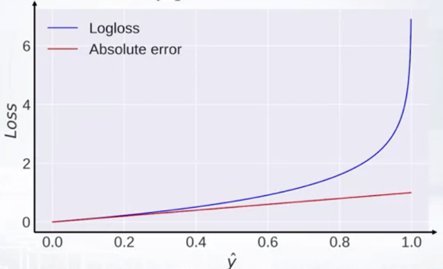
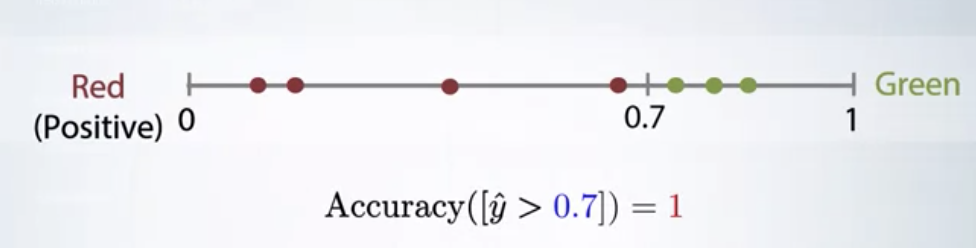

# Classification metrics review
b]_{i}" title="hard label-1" />

* soft labels (soft prediction) are classifier's scores
* Hard labels (hard predictions)
  * 
  *  
  * $$[d(x)>b]_{i}$$  ($$b$$ = threshold)

 

#### Logarithmic loss (logloss)

* In binary classification
  $$LogLoss = -\frac{1}{N}\sum^{N}_{i=1}y_{i}log(\hat{y_{i}})+(1-y_{i})log(1-\hat{y_{i}})$$
* In multicalss classification
  $$LogLoss=-\frac{1}{N}\sum^{N}_{i=1}\sum^{L}_{i=1}y_{il}log(\hat{y_{il}})$$ , where $$y_{i}\in\mathbb{R}^{L}$$ , $$\hat{y_{i}}\in\mathbb{R}^{L}$$
* In practice
  $$LogLoss=-\frac{1}{N}\sum^{N}_{i=1}\sum^{L}_{i=1}y_{il}log(min(max(\hat{y_{il}}, 10^{-15}), 1-10^{-15}))$$

The clssifier output probability, and the binary and multiclass classigication formula are different

$$N$$=number of objects, $$L$$=number od classes, $$y$$=ground truth, $$\hat{y}$$=prediction, $$[a=b]$$=indicator function

$$LogLoss = -\frac{1}{N}\sum^{N}_{i=1}y_{i}log(\alpha)+(1-y_{i})log(1-\alpha)$$

* Logloss usually penalizes completely wrong answers and prefers to make a lot of small mistakes to one but severer mistake. 
* Best constant: set  $$\alpha_{i}$$ to frequency of the $$i$$-th class 
  * Example dataset: 10 cats, 90 dogs $$\to$$ $$\alpha=[0.1, 0.9]$$

 

##### Area Under Curve (AUC ROC)

We usually take soft predictions from our model and apply threshold. This metric kind of tries all possible ones and aggregates those scores. We find the maximum value of AUC, and don’t need to define the threshold.

$$AUC=\frac{\#\ correctly ordered paies}{total number of pairs}=1-\frac{\#\ incorrectly ordered pairs}{total number of pairs}$$

* Only for binary tasks
* Depends only on ordering of the of the predictions, not on absolute values
* Several explanations
  * Area under curve
  * Pairs ordering
* Best constant:
  * All constants give same scores
* Random predictions lead to AUC=0.5

 

#### Cohen's Kappa

In Cohen’s Kappa we take another value as baseline. We take the higher predictions for the dataset and shuffle them, like randomly permute. And then we calculate an accuracy for these shuffled predictions.
and that we be our baseline.

$$Cohen's\ Kappa=1-\frac{1-accuracy}{1-p_{e}}$$  , where $$p_{e}=\frac{1}{N^2}\sum_{k}n_{k1}n_{k2}$$

$$p_{e}$$=what accuracy would be on average, if we randomly permute our predictions

 

$$Cohen's\ Kappa=1-\frac{error}{baseline\ error}$$

Example 

* dataset: 10 cats and 90 dogs
* Predict 20 cats and 80 dogs at random
  * $$accuracy\sim 0.2*0.1 + 0.8*0.9 = 0.74$$
  * $$error=1-accuracy=0.26$$

