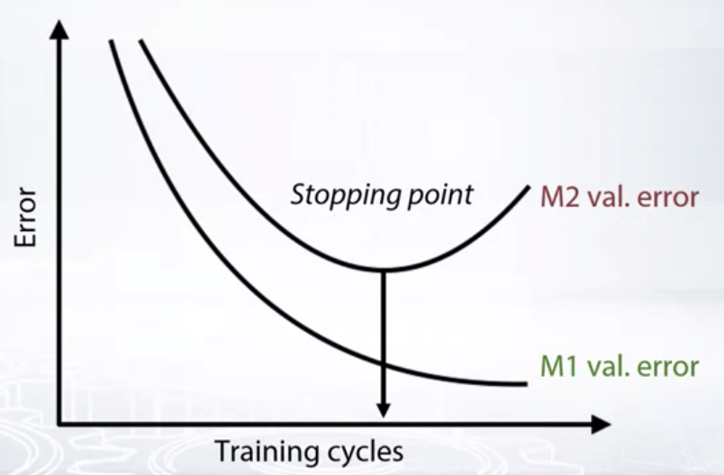

# Week 3 Note

## Metrics optimiation

>If your model is scored with some metric, you get best results by optimizing exactly that matric

#### [Regression Matrics Review](Regression-metric-review.md)

* MSE, RMSE, R-squared (Synonyms: **L2 loss**)
  * They are the same from optimization perspective
* MAE (Synonyms: **L1 loss, Median regression**)
  * Robust to outliers, much less biased
* MSPE, MAPE
  * Weighted version of MSE/MAE
  * biased towards smaller targets because they assign higher weight to the object with small targets.
* RMSLE
  * MSE in log space
  * frequently considered as better metrics than MAPE, since it is less biased towards small targets, yet works with relative errors.

MAE is more robust than MSE (it is not that influence by outliers, doesn’t mean it’s always better use MAE then MSE)

- Do you have outliers in the data?  use MAE
- Are you sure they are outliers?  use MAE
- Or they are just unexpected values we should still care about?  use MSE

####[Classification metrics review](Classification-matric-review.md)

* Accuracy
* Logloss
* AUC (ROC)
* Cohen's  (Quadratic weighted) Kappa

classification materials

- [Evaluation Metrics for Classification Problems: Quick Examples + References](http://queirozf.com/entries/evaluation-metrics-for-classification-quick-examples-references)
- [Decision Trees: “Gini” vs. “Entropy” criteria](https://www.garysieling.com/blog/sklearn-gini-vs-entropy-criteria)
- [Understanding ROC curves](http://www.navan.name/roc/)

#### General approaches for metrics optimization

- **Just run the right model!**
  - MSE, Logloss
- **Preprocess train and optimize another metric**
  - MSPE, MAPE, RMSLE, .....
- **Optimize another metric, postprocess predictions**
  - Accuracy, Kappa
- **Write custom loss function**
  - Any, if you can
- **Optimize another metric, use early stopping**
  - Any

 

**early stopping**

Optimize metric M1, monitor metric M2, stop when M2 score is the best.

#### Regression metrics optimization

- Use weights for samples (`sample_weights`)
  - And use MSE (MAE)
  - Not every library accepts sample weights
    - XGBoost, LightGBM accept
    - Neural nets: Wasy to implement if not supported
- Resample the train set
  - `df.sample(weights=smple weights)`
  - And use any model that optimizes MSE (MAE)
  - Usually need to resample many times and average

[Here are some of the library that support mean square error optimization](Regression-metrics-optimization.md)

 

MSPE(MAPE) as weighted MSE(MAE)

$$MAPE=\frac{100\%}{N}\sum^N_{i=1}|\frac{y_{i}-\hat{y_{i}}}{y_{i}}|$$

$$w_{i}=\frac{\frac{1}{y^2_i}}{sum^N_{i=1}\frac{1}{y^2_i}}$$

#### Classification metrics optimization

[Here are some of the library that support classification matrics (Logloss & AUC) optimization](Classification-metrics-optimization.md)

Probability calobration

* Platt scaling
  * Just fit Logistic Regression to your predictions (like in stacking)
* Isotonic regression
  * Just fit Isotonic Regression to your predictions (like in stacking)
* Stacking
  * Just fit XGBoost or neural net to your predictions

there exists an algorithm to optimize AUC with gradient-based methods: **Pairwise loss**

$$min\sum^N_i\sum^N_jl_{pair}(\hat{y}_i, \hat{y}_j; y_i, y_j)$$

$$Loss=-\frac{1}{N_0N_2}\sum^{N_1}_{j:y_j=1}\sum^{N_0}_{i:y_i=0}log(prob(\hat{y_j}-\hat{y}_i))$$

Quadratic weighted Kappa

* To optimize Quadratic weighted Kappa, optimize MSE and find the right thresholds

  * Simple

  * Optimize MSE

    

  * Find right threshold

    * Bad: `np.round(prediction)`
    * Better: optimize thresholds

* Custim smooth loss for GBDT or neural nets

  * Harder

Ranking materials

- [Learning to Rank using Gradient Descent](http://icml.cc/2015/wp-content/uploads/2015/06/icml_ranking.pdf)-- original paper about pairwise method for AUC optimization
- [Overview of further developments of RankNet](https://www.microsoft.com/en-us/research/wp-content/uploads/2016/02/MSR-TR-2010-82.pdf)
- [RankLib](https://sourceforge.net/p/lemur/wiki/RankLib/)(implemtations for the 2 papers from above)
- [Learning to Rank Overview](https://wellecks.wordpress.com/2015/01/15/learning-to-rank-overview)

clustering

- [Evaluation metrics for clustering](http://nlp.uned.es/docs/amigo2007a.pdf)